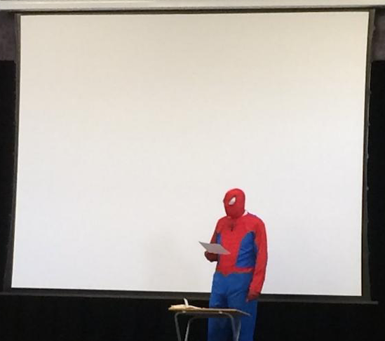
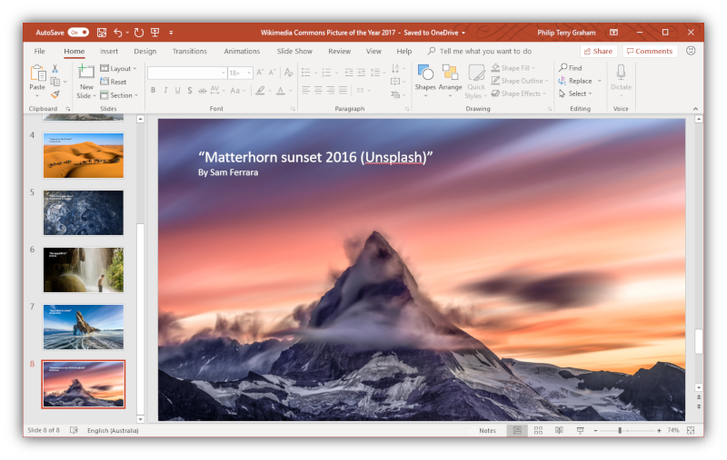

Everyone wants to make cool presentations. How can we do that?

  
Content

  
  1. Creativity
  2. Tools
  3. Soft skills
  

## 1 Creativiry

- To make your presentation unique, you need to be talented.
- What can you add:
    - Funny videos.
    - Graphs and statistics.
    - Memes.
    - Minimalictic design.

## 2 Tools

There are a lot of online tools and apps to make grear colorful presentations.
- [Powerpoint](https://ru.wikipedia.org/wiki/Microsoft_PowerPoint)
- [Canva](https://canva.com) (работает только с VPN)
- [LibreOffice](https://ru.wikipedia.org/wiki/LibreOffice) (бесплатный аналог офисного пакета Майрософт)

## 3 Soft skills

Very often the success of your talk is made not by the presentation itself, but by ability to deliver your thoughts to the audience. Practise and speak more to get rid of fear of public speeches and find out how to behave with the listeners correctly.

Good luck!

