# Цель работы

Изучить основы безопасности в сети.

# Выполнение работы

1. Единственным протоколом прикладного уровня из списка является протокол HTTPS.

2. Протокол TCP работает на транспортном уровне.

3. В 8 битах 256 разных значений, но нумерация идет с нуля и как итог, допустимые значения в IP адресе - с 0 до 255.

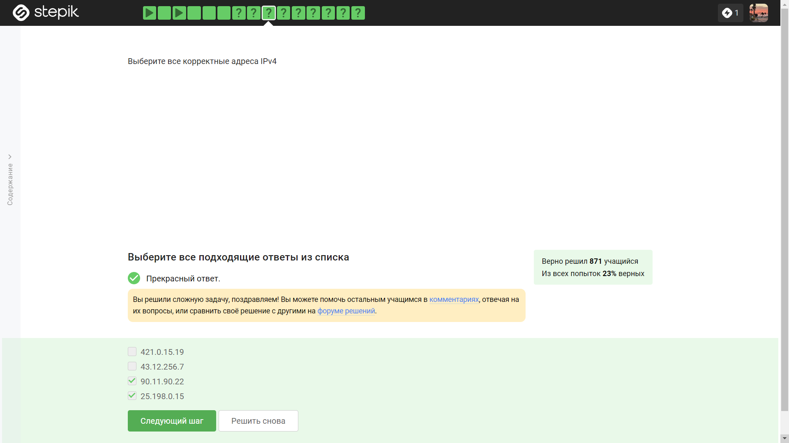

4.  Основная задача DNS-сервера - это сопоставить название, то есть доменное имя, с корректным IP-адресом, с тем, где лежит этот сервер, этот сайт. 

5. Корректная последовательность протоколов в модели TCP/IP: прикладной-транспортный-сетевой-канальный.

6. Протокол http, в отличие от протокола https, предполагает передачу данных между клиентом и сервером в открытом виде. 

7. Протокол https состоит из двух фаз: рукопожатия (handshake) и передачи данных.

8. Версия протокола TLS определяется и клиентом, и сервером в процессе "переговоров".

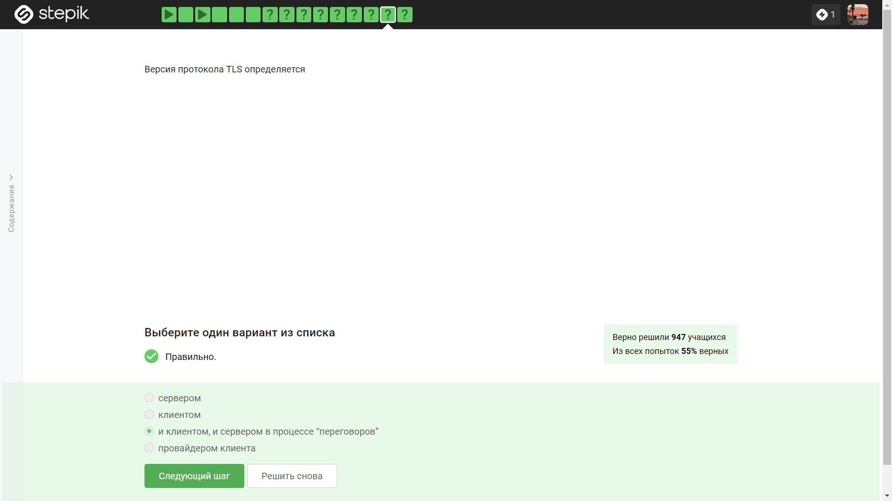

9. В фазе рукопожатия не предусмотрено шифрование данных, так как эта фаза является вводной перед защищенной передачей данных. 

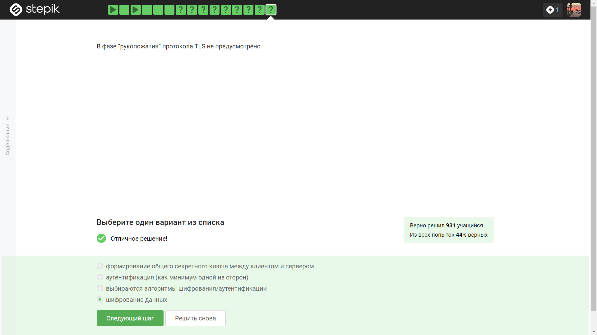

10. Куки хранят id сессии, идентификатор пользователя, пароль и IP адрес они не хранят.

11. Куки не используются для улучшения надежности соединения, они с соединением пользователя никак не связаны.

12. Куки генерируются сервером для клиента.

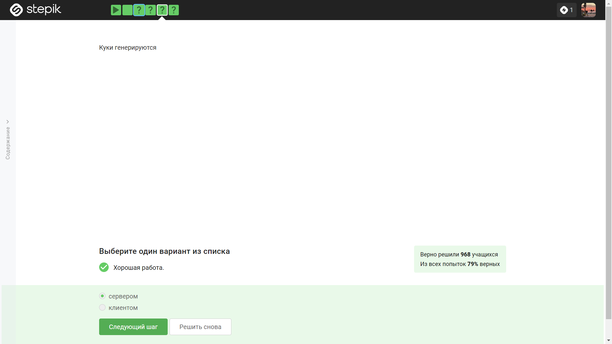

13. Сессионные куки хранятся в браузере до конца сессии, то есть на время пользования веб-сайтом.

14. В луковой сети TOR 3 промежуточных узла: охранный, промежуточный и выходной.

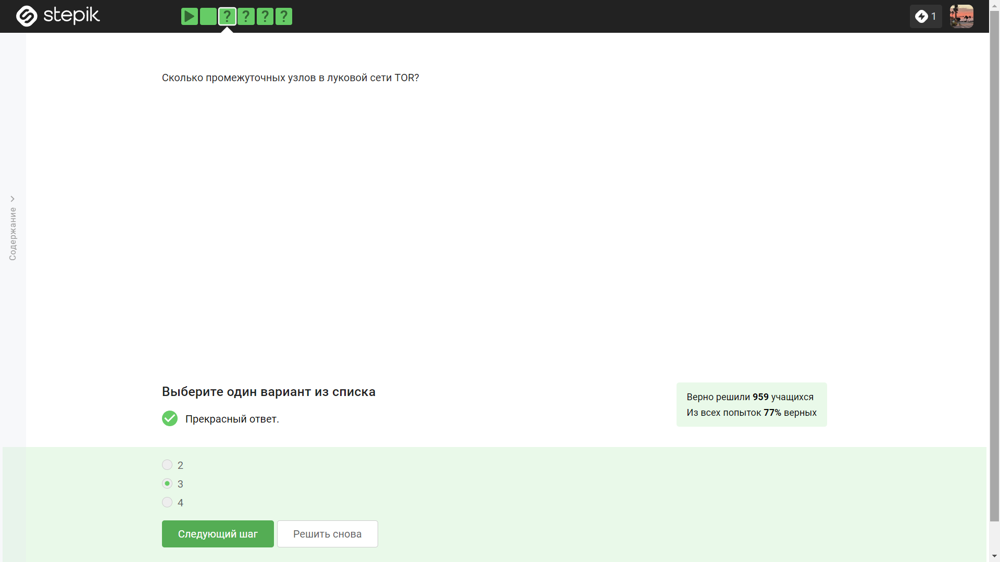

15. В TOR IP-адрес получателя известен лишь отправителю и выходному узлу, это одна из причин почему TOR считается конфиденциальной сетью.

16. Отправитель генерирует общий секретный ключ со всеми тремя узлами: с охранным, с промежуточным, с выходным. Этот процесс делает передачу данных крайне защищенной. 

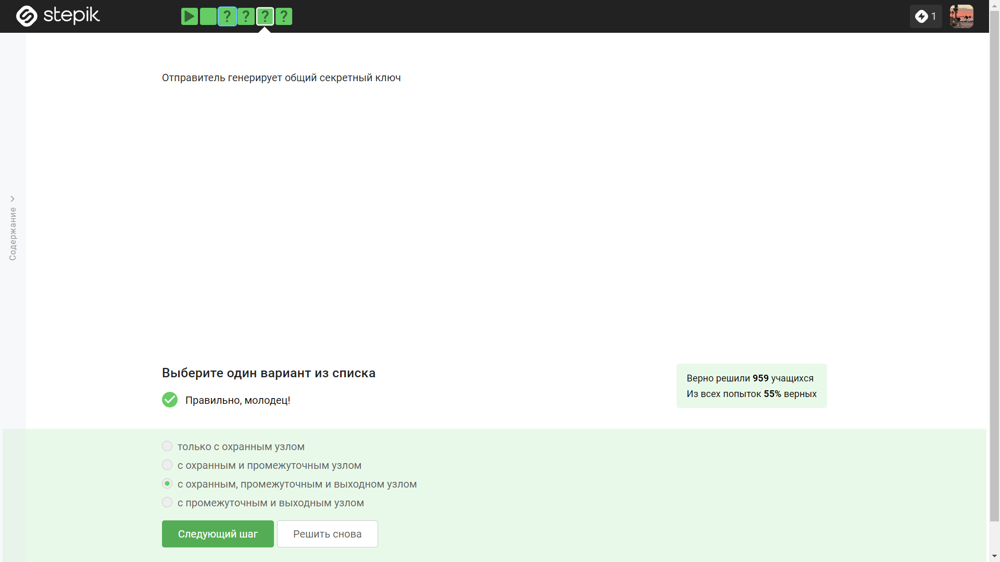

17. Для получения пакетов через луковую маршрутизацию необязательно использовать браузер, основанный на луковой маршрутизации, это обязательно для отправителя пакетов.

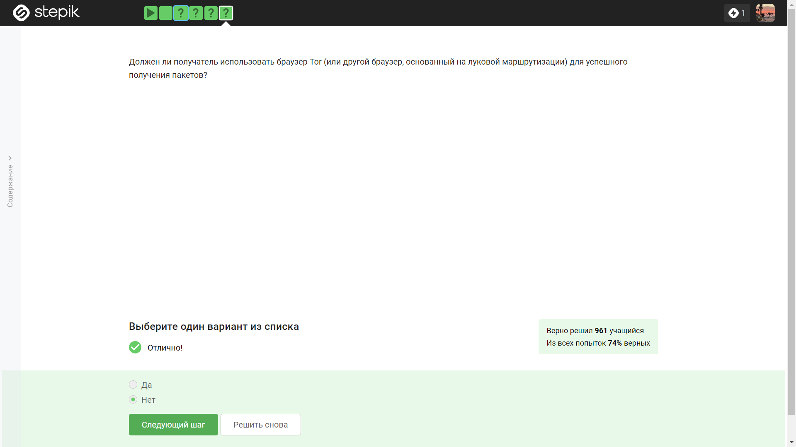

18. Согласно определению, Wi-Fi - это технология беспроводной локальной сети, работающая в соответствии со стандартом IEEE 802.11. 

19. Протокол Wifi работает на самом нижнем, канальном уровне.

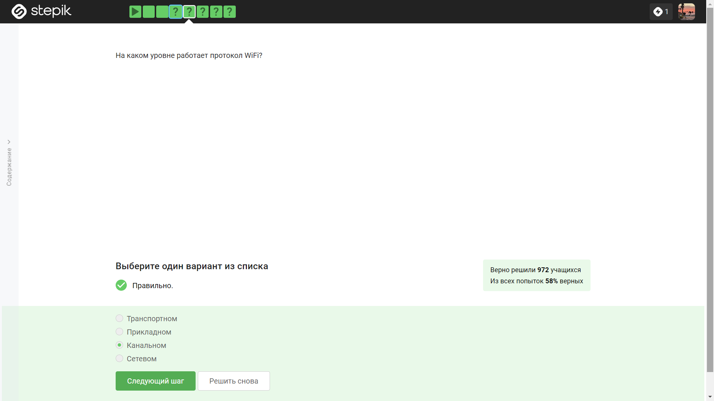

20. Небезопасным методом обеспечения шифрования и аутентификации в сети Wifi является WEP, так как он устарел, в частности, потому, что использовал малую длину ключа: так, например, он использовал длину ключа в 40 бит, это довольно мало на сегодняшний день, он может быть легко взломан.

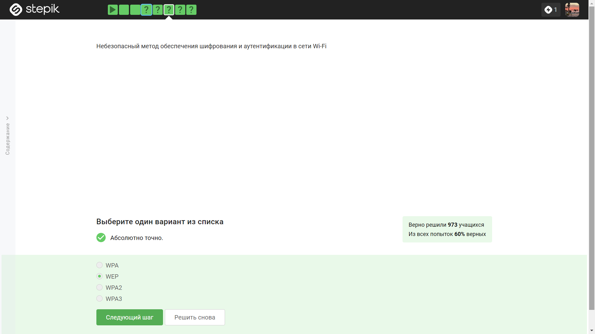

21. Данные между хостом сети (компьютером или смартфоном) и роутером передаются в зашифрованном виде после аутентификации устройств.

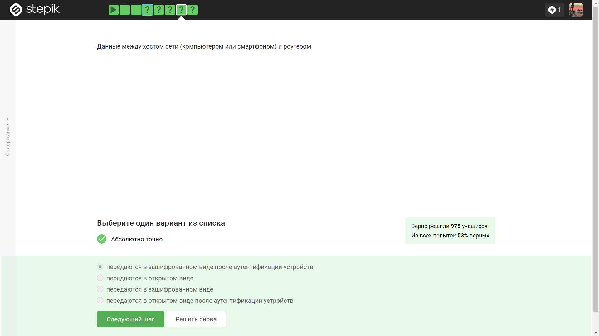

22. Для домашней сети для аутентификации обычно используется метод WPA2 Personal, WPA2 Enterprise используется для корпоративных сетей.

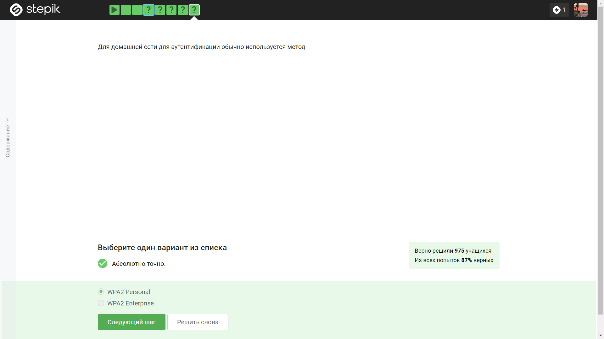

# Выводы

Я изучил основы безопасности в сети.

# Список литературы

Конспекты к лекциям курса "Основы кибербезопасности".
